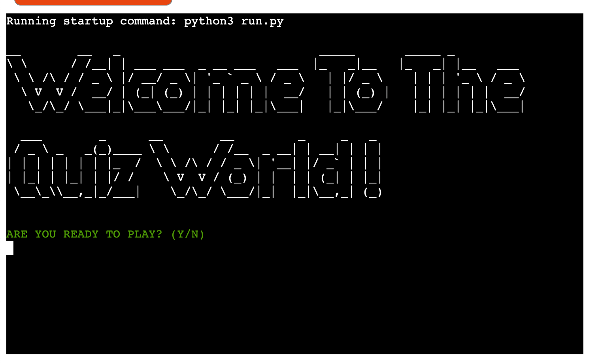
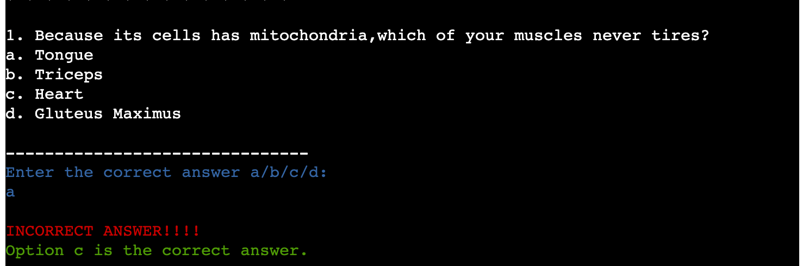

# Test Your Knowledge on Human Body

## Table of Contents:

## Introduction:
Test your knowledge on human body is a CLI(Command Line Interface) quiz game. It is about fun facts about the human body represented in the form of quiz questions. There are 10 multiple-choice questions and the user has to enter the correct choice in order to increase their score.

## User Stories and Wireframes

### Goals
The aim of this simple quiz CLI game is to be able to improve ones's general knowledge and at the same time enjoy it in the form of a quiz game.

## User Story 1: 
As a user I want to build an app using python for a fun quiz game on human body so that I can check my general knowldege.

IMPLEMENTATION

* Welcome message and Instructions:

    * A welcome message is displayed on the terminal.
    * Instructiom is  displayed asking whether to begin the game.
    * The instructions to play the game are displayed.

 

## User story 2:
As a user I want to experience learning and score myself so that I can rate myself and an app to do so is available.

IMPLEMENTATION

* The quiz is in the form of multiple choice questions.
* Each correct response is given 10 points.
* After every incorrect response, the correct answer is also displayed, and the score increases by 10 points.
* Any invalid selection displays the error message.

## User Story 3:
As a user I would like to see my final score so that I can rate my knowldege on the quiz questions.

IMPLEMENTATION:

## User story 4:
As a user I would like to quit the quiz, or be able to play again so that i can stop or start the game once again to improve my scores.

IMPLEMENTATION:

* At the end of 10th question a message asking whether the user want to quit the quiz is displayed.
* If user chooses yes, then 'quitting game' message is displayed and the game ends.
* If the user chooses no, then 'playing again' message is displayed and the quiz begins again starting from the 1st question.
* If there are any errors entered, it is taken into account and 'invalid choice, please enter yes/no' is displayed.

### ERROR HANDLING

Error handling was implemented throughout the application withthe use of while True if, elif and else statements to handle exceptions raised by invalid entry errors.

### Features left to be implemented

* In future, an explanation about the correct answer can be added providing more information on the question topic.
* Scoring can be made more challenging by including negative scoring for incorrect responses.
* The visual representation can be made more fun and colorful.

