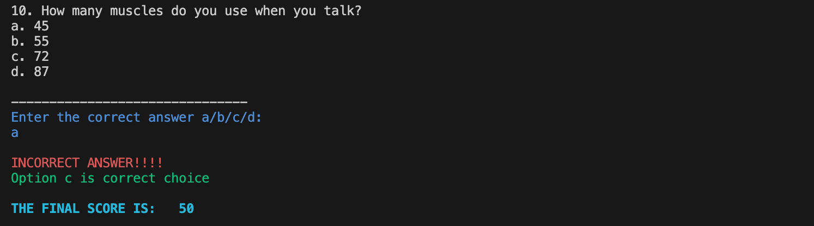
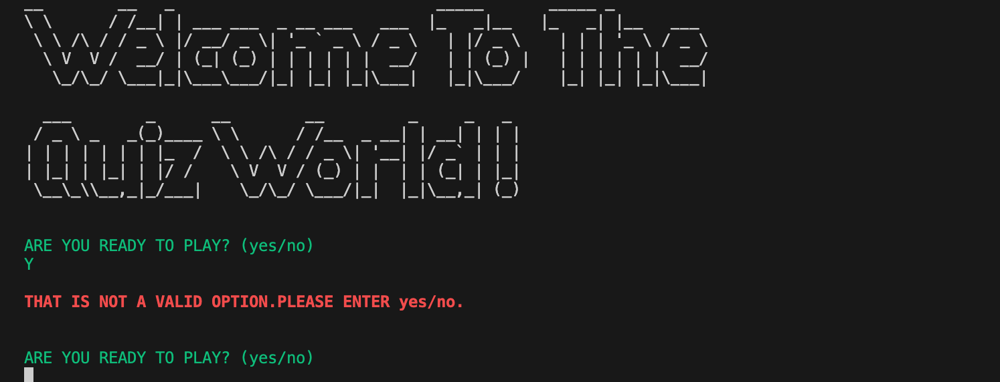

# Test Your Knowledge on Human Body

## Table of Contents:
* [Introduction](#introduction)

    * [Wireframe and User stories](#wireframe-and-user-stories)
        * [Wireframe](#wireframe)
        * [Goals](#goals)
        * [User story 1](#user-story-1)
        * [User story 2](#user-story-2)
        * [User story 3](#user-story-3)
        * [User story 4](#user-story-4)
    * [Error Handling](#error-handling)
    * [Features left to be implemented](#features-left-to-be-implemented)
* [Technologies Used](#technologies-used)
* [Testing](#testing)

    * [Functional Testing](#functional-testing)
    * [PEP8 Validation](#pep8-validation)
    * [Bugs and Fixes](#bugs-and-fixes)
* [Deployment](#deployment)
    * [Version Control](#version-control)
    * [Heroku Deployment](#heroku-deployment)
* [Credits](#credits)

## Introduction:
Test your knowledge on human body is a CLI(Command Line Interface) quiz game. It is about fun facts about the human body represented in the form of quiz questions. There are 10 multiple-choice questions and the user has to enter the correct choice in order to increase their score.

## Wireframe and User Stories:

### Wireframe

* The wireframe for the project is displayed in the form of a simple flow-chart. It gives an overview of how the quiz game operates and the coding for this project was planned.

### Goals
The aim of this simple quiz CLI game is to be able to improve ones's general knowledge and at the same time enjoy it in the form of a quiz game.

## User Story 1:
As a user I want to build an app using python for a fun quiz game on human body so that I can check my general knowldege.

IMPLEMENTATION

* Welcome message and Instructions:

    * A welcome message is displayed on the terminal.
    * Instructiom is  displayed asking whether to begin the game.
    * The instructions to play the game are displayed.

## User story 2:
As a user I want to experience learning and score myself so that I can rate myself and an app to do so is available.

IMPLEMENTATION

* The quiz is in the form of multiple choice questions.
* Each correct response is given 10 points.
* After every incorrect response, the correct answer is also displayed, and the score increases by 10 points.
* Any invalid selection displays the error message.

## User Story 3:
As a user I would like to see my final score so that I can rate my knowldege on the quiz questions.

IMPLEMENTATION:

* At the end of the 10th question, final score obtained by the user is displayed.

## User story 4:
As a user I would like to quit the quiz, or be able to play again so that i can stop or start the game once again to improve my scores.

IMPLEMENTATION:

* At the end of 10th question a message asking whether the user want to quit the quiz is displayed.
* If user chooses yes, then 'quitting game' message is displayed and the game ends.
* If the user chooses no, then 'playing again' message is displayed and the quiz begins again starting from the 1st question.
* If there are any errors entered, it is taken into account and 'invalid choice, please enter yes/no' is displayed.

### ERROR HANDLING

Error handling was implemented throughout the application withthe use of while True if, elif and else statements to handle exceptions raised by invalid entry errors.

### Features left to be implemented

* In future, an explanation about the correct answer can be added providing more information on the question topic.
* Scoring can be made more challenging by including negative scoring for incorrect responses.
* The visual representation can be made more fun and colorful.

## Technologies Used:

* Python was the main language used to build the application.
    * Python packages used:
    - Colorama - used to make the text fot instructions, questions, and important messages displayed in a different color to    make visually appealing.
    - Pyfiglet - used to change the font of the welcome message.
* TinyPNG
[Tinypng](https://tinypng.com/) was used to convert the images to png format.
* Lucid Chart
    * [Lucid_Chart](https://lucid.app/user/208362927#/subscriptionLevel/chart/levelType) was used to make the wireframes of the quiz.

## Testing

### Functional testing

* Step One:
    * When the program is run, a welcome message is displayed and a question to start the quiz is displayed.
    - Expected: Correct options yes/no are displayed.
    - Actual: Correct options are displayed.

* Step Two:
    * If 'yes' is selected, game instructions are displayed and the MCQ (Multiple Choice Questions) are displayed.
    - Expected : Quiz instructions are displayed and the questions are also displayed.
    - Actual : As expected quiz instructions and the questions are displayed.

* Step Three:
    * If 'no' is selected, a message is displayed that the game is closing.
    - Expected : Closing game message should be displayed.
    - Actual : As expected, closing game message is displayed.

* Step Four :
     * If anything else is entered, for example, 'Y', 'N', 'y', 'n' etc invalid error message is displayed.
     - Expected : A message displaying to enter either Y/N as valid option is displayed.
     - Actual : As expected, invalid error message is displayed.

* Step Five :
    * Questions are displayed starting from question number 1 with four choices (a,b,c,d). Correct answer to be entered.
    - Expected : If correct answer is entered, current score with 10 points increment is displayed, if wrong answer is entered, then correct answer choice is also displayed.
    - Actual : As expected, current score is added with every correct answer entered and correct answer choice is displayed if wrong answer is entered and no score increment.

* Step Six :
    * If any invalid choice is entered for example 'C', 'A' etc, invalid error message is displayed, and again to enter the correct answer to be entered is displayed.
    - Expected : Error message is displayed.
    - Actual: Error message is displayed.

* Step Seven :
    * Final score is displayed at the end of last question.
    - Expected : Final score obtained by the user is displayed.
    - Actual : As expected, final score is displayed.

* Step Eight :
     *  At the end of 10th question, a question is displayed whether user wants to quit the quiz.
     - Expected : A message is displayed asking whether user wants to quit the quiz.
     - Actual : The expected message is displayed.

* Step Nine :
    * If answer to quit the quiz is 'yes', then game ends and 'quitting game' message is displayed.
    - Expected : Game ends and quitting game is displayed.
    - Actaul : As expected, game ends and quitting game message is displayed.

* Step Ten :
    * If answer to quit the quiz is 'no', then game begins again and 'Playing again' message is displayed.
    - Expected : Playing again message is displayed and the game begins.
    - Actual : As expected, playing again message is displayed and the game begins.

* Step Eleven :
    * If any invalid error message is entered, 'invalid choice' message is displayed and asked to enter either 'yes/no'.
    - Expected : 'Invalid Choice' and the message to quit the quiz is asked again.
    - Actual : As expected, 'invalid choice' and the message to quit the quiz is asked again.

### PEP8 Validation

All python code was ran through pep8ci.herokuapp.com validator and any warnings or errors were fixed. Code then validated successfully.

### Bugs and Fixes

* Removed trailing whitespaces and length of lines whose length were greater than 72 characters had to be reduced or moved to the next line to pass the validation.
* In game start and quit game, even if any thing else was entered apart from yes/no, the game began or ended, so had to write the codes to include messages for invalid choice and quitting game options.
* Also the final score at the end of the game was not displayed and had to rewrite functions to include it.

## Deployment

### Version control

* The site was created using the Visual Studio Code editor and pushed to github to the remote repository "Test your knowledge on Human Body".

* The following git commands were used throughout development to push code to the remote repo:
    * 'git add . ' - This command was used to add the file(s) to the staging area before they are committed.
    * 'git commit -m "message to be typed" ' - This command was used to commit changes to the local repository queue ready for the final step.
    * 'git push' - This command was used to push all committed code to the remote repository on github.

### Heroku Deployment

The below steps were followed to deploy this project to Heroku:

* Go to Heroku and click "New" to create a new app.
* Choose an app name and region region, click "Create app".
* Go to "Settings" and navigate to Config Vars. Add the following config variables:
    * PORT : 8000
* Navigate to Buildpacks and add buildpacks for Python and NodeJS (in that order).
* Navigate to "Deploy". Set the deployment method to Github and enter repository name and connect.
* Scroll down to Manual Deploy, select "main" branch and click "Deploy Branch".
* The app will now be deployed to heroku.

## CREDITS

* Two YouTube tutorials on quiz helped me in making this project.
    * [YouTube Tutorial 1](https://www.youtube.com/watch?v=-I96VIIiIXk)
    * [YouTube Tutorial 2](https://www.youtube.com/watch?v=zehwgTB0vV8)
* W3C Tutorials for writing python functions and Code institute study materials were used throughout the project.
* I would like to extend my thanks to my mentor Gareth Mc.Girr for his constant support and suggestions to improve my project.
